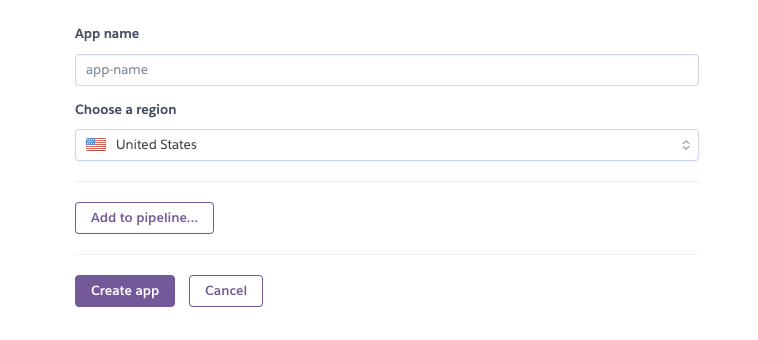
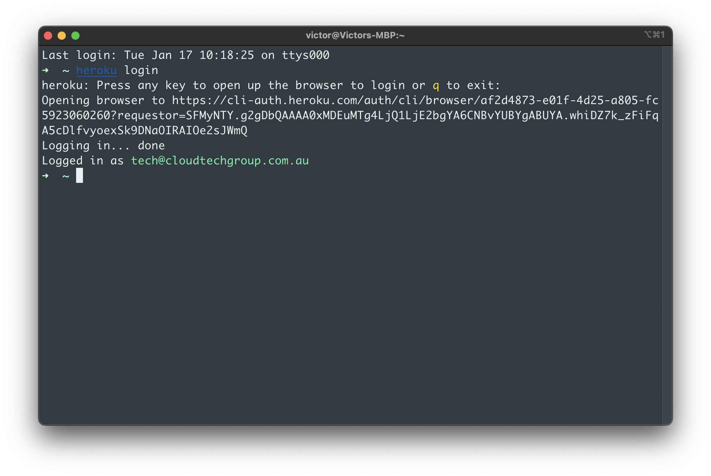

# Django部署到Heroku

使用Github和Heroku

# 1.0 到官网创建Heroku项目

[Heroku](https://dashboard.heroku.com/new-app)



# 2.0 安装Heroku Cli

[The Heroku CLI](https://devcenter.heroku.com/articles/heroku-cli#install-the-heroku-cli)

```bash
brew tap heroku/brew && brew install heroku
```

# 3.0 链接本地路径到Heroku git

```bash
heroku login # 登录账号
```



```bash

git init

heroku git:remote -a cre-api #链接git仓库

git remote -v #查看链接的远程git仓库
```

# 4.0 配置文件

- requirements.txt
    
    ```bash
    pip install gunicorn whitenoise # 安装必须的插件
    
    cd src # 切换到项目root路径
    pip freeze > requirements.txt # 生成requirements.txt文件
    
    ```
    
- runtime.txt
    
    ```bash
    python-3.9.6
    ```
    
- Procfile —> 启动wsgi服务
    
    ```bash
    web: gunicorn cre_api.wsgi --log-file -
    ```
    

# 5.0 设置buildpack

[Heroku](https://dashboard.heroku.com/apps/cre-api/settings)


# 6.0 上传文件

```bash
git add .

git commit -am "make it better"

git push heroku main
```

# 7.0 部署失败原因

- Python版本不对 —> 使用Heroku支持的python版本
    
    [Heroku Python Support](https://devcenter.heroku.com/articles/python-support)
    
- Error while running '$ python [manage.py](http://manage.py/) collectstatic --noinput'
    
    ```bash
    heroku config:set DISABLE_COLLECTSTATIC=1
    ```
    
    以上方法会导致线上环境缺失样式
    
    ```bash
    # 改回0
    heroku config:set DISABLE_COLLECTSTATIC=0
    ```

    ```python
    # 在项目根目录创建static文件夹
    # 在seetings.py文件中添加路径
    STATIC_URL = '/static/'
    STATIC_ROOT = os.path.join(BASE_DIR, 'staticfiles')
    
    MEDIA_URL = '/media/'
    MEDIA_ROOT = os.path.join(BASE_DIR, 'media')
    
    # 添加whitenoise中间件
    MIDDLEWARE = [
        # ...
        "whitenoise.middleware.WhiteNoiseMiddleware",
        # ...
    ]
    ```
    

# 8.0 跨域请求

安装 django-cors-headers 解决

[[ Django ] django前后端分离项目解决跨域问题](https://juejin.cn/post/6999893695650594847)

[Django项目解决跨域问题](https://segmentfault.com/a/1190000023094147)

```python
# seetings.py 添加如下

CORS_ORIGIN_ALLOW_ALL = True
CORS_ALLOW_CREDENTIALS = True

X_FRAME_OPTIONS = 'SAMEORIGIN'
```